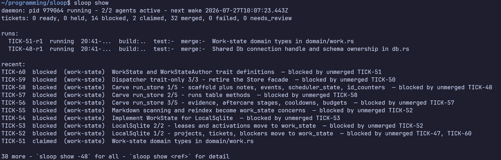

<p align="center">
  
  
</p>

Sloop runs agentic coding work autonomously: each ticket gets its own Git
worktree and agent (Claude Code, Codex, or OpenCode), and Sloop reviews the
result and merges it when it passes.

The model is small: **flows are behaviour, tickets are work, projects are
scope.** A flow says how work proceeds, a ticket says what the work is, and a
project says which work belongs together.

- **Agent orchestration** — each ticket picks its agent, model, and effort:
  design with a powerful model, send implementation and review to specialized
  workers.
- **Agentic loops** — combine predefined flows, parallel multi-agent
  execution, and scheduled runs.
- **Runs while you sleep** — background agents work unattended within your
  running hours; wake up to finished work.
- **Repeatable** — tickets are Markdown files in your repo, easy to share and
  re-run.

<p align="center">
  
</p>

<p align="center">
  More: <a href="docs/assets/show-ticket.png">ticket detail</a> ·
  <a href="docs/assets/show-follow.png">live event feed</a> ·
  <a href="docs/assets/help.png">CLI help</a>
</p>

Under the hood it's a small deterministic kernel that checks what untrusted
processes propose. A Rust daemon supervises each run, enforces shared rate
limits, and derives every verdict from evidence it observed itself — process
exit, commits, tests — rather than from the agent's word.

Full documentation lives in [docs/](docs/).

**Install**

```sh
curl --proto '=https' --tlsv1.2 -LsSf \
  https://github.com/hamish-mackie/sloop/releases/latest/download/sloop-installer.sh | sh
```

Prebuilt binaries are also on the [releases page](https://github.com/hamish-mackie/sloop/releases).

**Initialize**

```sh
sloop init    # Configure this repository
sloop daemon  # Start the scheduler
```

**Write a ticket** (`my-ticket.md`)

```markdown
---
name: Add request logging
blocked_by: []
target: claude
model: sonnet
effort: medium
---

Log each HTTP request with its method, path, status, and duration.
```

**Post it**

```sh
sloop post my-ticket.md
sloop show                # Ticket status, and why pending ones aren't running
sloop logs <run-id>       # Follow a run's output
```

---

## Configuration

`sloop init` creates `.agents/sloop/config.yaml` with working targets for
Claude Code, Codex, and OpenCode. To change when work runs or which agent Sloop
uses, edit the generated config:

```yaml
version: 1

scheduler:
  max_parallel_tasks: 2
  running_hours:
    start: "22:00"
    end: "06:00"

agent:
  default_target: claude
  targets:
    claude:
      model: opus
      effort: high
      cmd: ["claude", "--print", "--model", "{model}", "--effort", "{effort}", "{prompt}"]
    opencode:
      cmd: ["opencode", "run", "--model", "{model}", "--variant", "{effort}", "{prompt}"]
    codex:
      model: gpt-5.6-sol
      effort: high
      cmd: ["codex", "exec", "--model", "{model}", "--config", 'model_reasoning_effort="{effort}"', "--sandbox", "workspace-write", "--ephemeral", "{prompt}"]
```

Running hours use local time and may cross midnight; omit them to run at any
time. Custom agent commands must include `{prompt}` exactly once; `{model}`
and `{effort}` come from the ticket, falling back to the target's `model:`
and `effort:` defaults. Keep secrets in environment variables.

## Flows

A flow is the ordered list of stages a ticket walks before its work can merge.
Every stage is three things: an `action` that does the work, a `result_check`
that judges it, and a `fail_action` saying what a failure does to the walk.

```yaml
stages:
  - name: build
    action: agent
    result_check: { builtin: commits }
  - name: test
    action: { exec: [cargo, test] }
    result_check: none
  - name: merge
    action: { builtin: merge }
    result_check: none
```

The split is the whole idea: an action never grades itself. `build` spawns the
ticket's agent, and `{ builtin: commits }` passes it only when Sloop observes a
new commit on the run branch — an agent that exits cleanly having written
nothing has not passed. `test` runs an argv in the run worktree and is judged by
its exit status. `merge` applies the branch using Sloop's merge policy.

`fail_action` defaults to `fail`, which halts the walk and leaves the branch for
review. `fail_action: continue` instead records the failure and carries on, for
advisory stages that report without blocking the merge;
`fail_action: { return_to: build, attempts: 2 }` sends the walk back to an
earlier stage and re-runs the span from there, handing the re-entered agent the
failure it has to fix. Both are covered in
[docs/configuration.md](docs/configuration.md#fail_action-what-a-failure-does-to-the-walk).

The filename is the flow name. Select one with `flow: <name>` in the ticket or
with `sloop post my-ticket.md --flow <name>`.

`sloop init` writes two flows. `default.yaml` is build → review → merge, where
review is a second agent that reports its own verdict with `sloop verdict`;
`train.yaml` is an opt-in merge train that syncs the default branch in and
verifies the result before a fast-forward-only merge, so nothing lands that the
verify stage did not run against. See
[docs/configuration.md](docs/configuration.md#the-merge-train).

To add a test gate to every flow without editing each one, set:

```yaml
flow:
  test_cmd: ["cargo", "test"]
```

This command runs as an implicit `test` stage at index 1, before the flow's
own later stages.

## Logs

Each run's full output is kept as `runs/<run-id>/output.ndjson` under Sloop's
state directory (on Linux, `~/.local/state/sloop/repositories/<repository>/`).
`sloop daemon` prints the exact log and socket paths on startup, and
`sloop logs <run-id>` is the normal way to read them.

## Tickets and projects

Tickets live under `.agents/sloop/tickets/` and projects under
`.agents/sloop/projects/` (both configurable). Every ticket belongs to one
project; `sloop init` creates a default for unassigned tickets. Projects group
and scope tickets, nothing more.

`blocked_by` lists the ticket IDs that must finish first; `[]` means none.
Posting rejects a missing `name`, an empty body, unknown blockers, and
dependency cycles, and assigns an ID and worktree branch (`sloop/<id>`) unless
you set your own. Reposting an edited file updates the ticket in place.

`sloop show <project>` lists recent notes and commits per ticket; add `--json`
for structured data.

## Design

Human-authored content lives in committed files. Runtime state lives in a
local SQLite database that only the daemon writes (bundled, nothing to
install). `sloop reindex` rebuilds whatever can be derived from committed
files and Git; runtime history such as notes may not survive it.

## License

Copyright 2026 Hamish Mackie. Licensed under the
[Apache License, Version 2.0](LICENSE).
